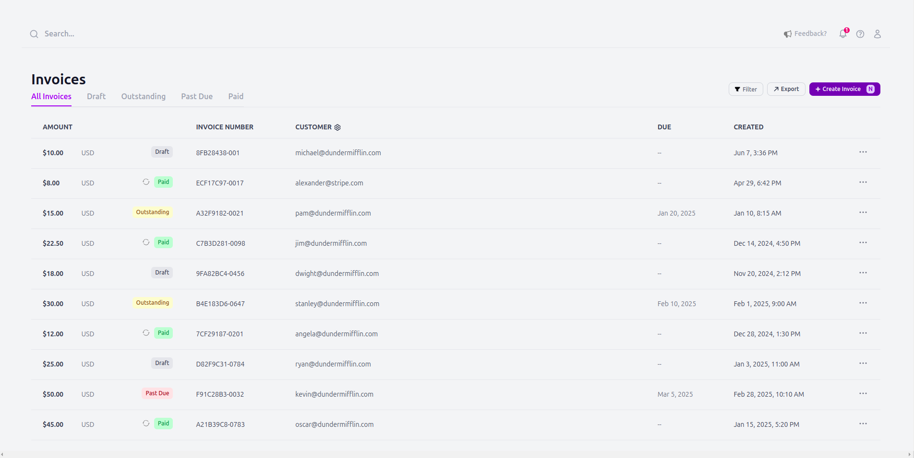
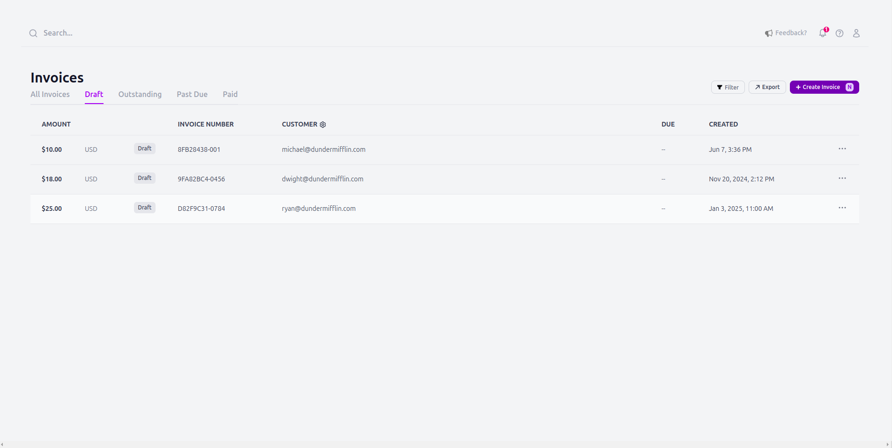
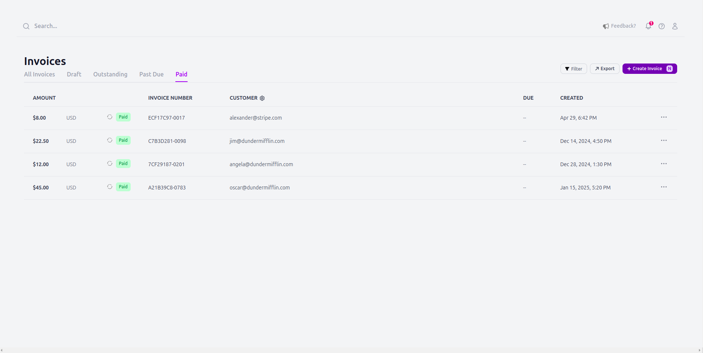
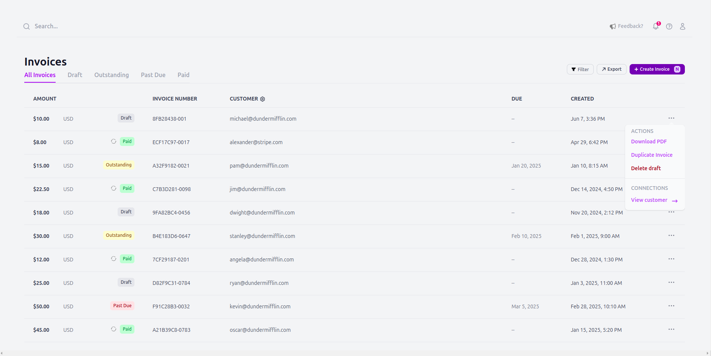

# Stripe Invoice Dashboard

## Project Overview

This project is a simplified version of the Stripe Invoice Dashboard, built using **Laravel Livewire** and **TailwindCSS**. It demonstrates the ability to create a UI with minimal interactivity to showcase Livewire's capabilities. The dashboard features tabs for filtering invoices, a dynamic table displaying invoice data, and a dropdown menu for each row. This project focuses on replicating the UI design, providing interactive functionality using Livewire.

## Features

-   **Tabs with Filtering**:
    -   Implemented clickable tabs (All invoices, Draft, Outstanding, Paid) that filter the invoice table dynamically using **Livewire**.
    -   The active tab is visually indicated, providing a smooth user experience.
-   **Invoice Table**:

    -   The table displays the following columns:
        -   Amount
        -   Invoice Number
        -   Customer Email
        -   Status (e.g., Draft, Paid) with color-coded labels
        -   Created Date
    -   **Hardcoded data** (5-10 rows) is used for simplicity in this version.

-   **Dynamic Dropdown (Optional)**:

    -   Each row has a dropdown menu that can be toggle.

## Technologies Used

-   **Laravel**: PHP framework used for building the backend and integrating Livewire components.
-   **Livewire**: A full-stack framework for Laravel that enables dynamic interfaces with minimal JavaScript.
-   **TailwindCSS**: Utility-first CSS framework for rapid styling and a consistent design system.

## Installation

To run this project locally, follow these steps:

1. **Clone the repository**

    ```bash
    git clone <repository_url>
    cd <project_directory>
    ```

2. **Install dependencies:**
    - Make sure you have PHP, Composer, and Node.js installed on your machine.
    - Run the following command to install PHP dependencies:
        ```bash
        composer install
        ```
    - Install Node.js dependencies for TailwindCSS:
        ```bash
        npm install
        ```
3. **Set up environment variables:**

    - Duplicate the .env.example file and rename it to .env:
        ```bash
        cp .env.example .env
        ```
    - Generate the application key:
        ```bash
        php artisan key:generate
        ```

4. **Run the development server:**

    - Start the Laravel development server:
        ```bash
        php artisan serve
        ```
    - Open your browser and go to http://127.0.0.1:8000 to view the application.

5. **Compile assets (for TailwindCSS)**:

    - Run the following command to compile the CSS:

        ```bash
        npm run dev

        ```

## Screenshots

Here are some screenshots of the application in action:

### Dashboard View









## License

### This project is licensed under the MIT License.
